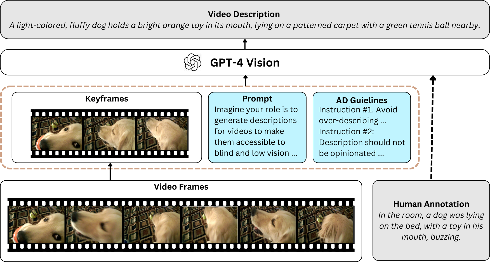

# VideoA11y: Method and Datasets for Accessible Video Description



## Files
```shell
.
├── utils
│   ├── cut_video.py
│   └── download_video.py
└── main.py

```

## Getting Started

### Installation

- Clone this repo:
```bash
git clone https://github.com/videoa11ygpt/VideoA11y.git
cd VideoA11y
```

- Dependencies
```
pip install -r requirements.txt
```

### Download Videos from YouTube

- Prepare your list of YouTube video IDs in a text file (e.g., `video_ids.txt`) from the dataset files.
- Run the script below:
  
```
python ./utils/download_video.py --max_workers <max_workers> --target_folder <Your folder to store videos> --video_ids_file <video_ids_file (e.g., `video_ids.txt`)>
```

## Generate Video Descriptions

- Run the script below with the necessary arguments: 

```
python main.py --video_folder <path/to/videos> --desc_file <path/to/original_descriptions.json> --target_file <path/to/target_descriptions.json> --api_key <your_OPENAI_api_key> --method <one from the four provided>
```
- --video_folder: Directory containing video files.
- --desc_file: File containing original video descriptions.
- --target_file: File where the generated video descriptions will be saved.
- --api_key: API key for accessing the AI processing features.
- --method: The processing method to use. Each of them represents a prompt. Options are:
    - GPT4V: Use only GPT-4V for video description (_GPT-4V_).
    - GPT4VHA: Combine GPT-4V with Human Annotation (_GPT-4V + Human Annotation_).
    - GPT4AD: GPT-4V with our AD Guidelines (_VideoA11y w/o HA_).
    - GPT4VADHA: Combination of GPT-4V, our AD Guidelines, and Human Annotation (**_VideoA11y_**).


## License

This project is licensed under [CC BY-NC 4.0](https://creativecommons.org/licenses/by-nc/4.0/) License.
